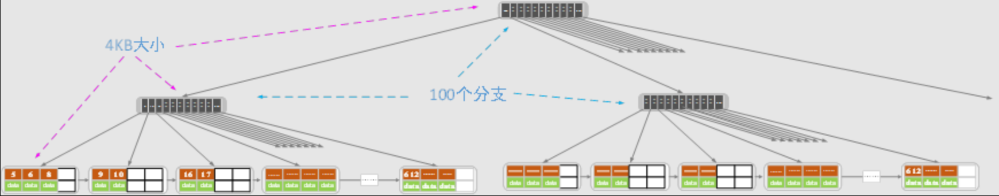
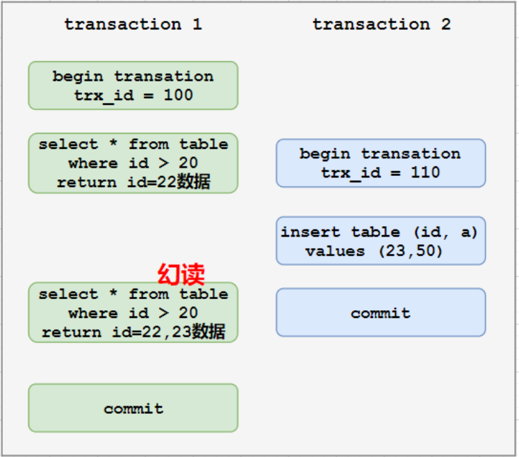
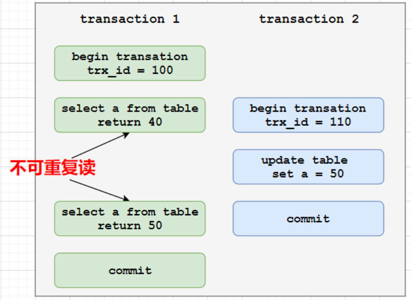
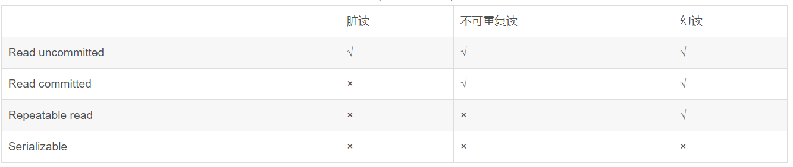

# myBplusTree
## B树的一些特性

B树也成为B-树，多路平衡查找树。阶数表示一个结点**最多**有多少个孩子结点。

m阶的B树定义如下：

（1）每个结点有m-1个关键字（少一个方便分岔）

（2）根结点最少1个关键字

（3）非根结点至少有Math.ceil(m/2)-1个关键字

（4）每个结点中关键字都按从小到大的顺序排列，每个关键字的左子树中的所有关键字都小于它，右子树中的所有关键字都大于它。

（5）所有叶子结点都位于同一层，或者说根结点到每个叶子结点的长度相同。

### B树插入操作

### B树删除操作

## B+树的一些特性

关键字个数比孩子结点少1，此外还需要满足：

（1）包含两种结点类型：内部结点和叶子结点。根结点本身可以是内部节点，也可以是叶子结点，根结点关键字个数最少可以只有1个。

**（2）B+树与B树最大的不同是内部结点不保存数据，只用于索引，所有数据都保存在叶子结点中。**

（3）m阶B+树表示了内部结点最多有m-1个关键字，阶数m同时限制了叶子结点最多存储m-1个记录。

（4）内部结点中的key都按照从小到大的顺序排列，对于内部结点的一个key，左子树的所有key都小于它，右子树的key都大于等于它。叶子结点中的记录也是按照key的大小排列。

**（5）每个叶子结点都存在相邻叶子结点的指针，叶子结点本身依关键字的大小自小到大顺序连接。**

### B+树插入操作

### B+树删除操作

## B+树引发的一些思考

### B+树一定比平衡二叉树在索引数据方面快么？

B+树的高度肯定会比平衡二叉树的高度要低很多，但是B+树在一个结点可能需要比较多的次数才能到下一个结点，但是平衡二叉树只要比较一次就可以向下走一层。综合的来说两种树的索引速度差不多的。

前文提到的索引速度的前提是两者都在内存之中的，当我们要从磁盘上索引一个记录时。当磁盘中的数据传输到内存才是花费时间的大头，而内存中的索引时间是几乎不计的。在磁盘中以B+树形式组织数据就有很大的优势。

为了更好的比较，需要先了解一个概念：**主存和磁盘的数据交换不是以字节为单位的，而是以n个扇区为单位的**（一个扇区有512字节），通常是4KB（8个扇区），8KB...64KB为单位的。

假设，现在选择4KB作为内存和磁盘之间的传输单位，不论是索引结点还是叶子结点都可以存4个记录，对于索引结点，由于只用存key和相应的指针，那么一个索引结点可以存100-150个分支，索引结点和叶子结点的阶数不一致，没有什么问题。假设一个结点存100个索引，则下图中两层索引一层叶子的B+树能存4万的数据，每一层花费一次IO，一共花费三次IO；相比之下平衡二叉树，一次查找的IO次数就是log2(40000)，大多了。

除此之外，如果查询一个范围的话，当然是B+树更方便了，因为叶子相邻的叶子结点是有指针相连的。

总结，都在内存中的话差不多，在磁盘上的话，B+树更块。快速的原因：**索引结点中只存键值和指针，所以一个结点可以存储大量的分支，而一个索引结点只需要一次IO即可读取到内存中。** 

### 当记录大小可变时，叶子结点中记录该如何存储？

## 一些杂谈

### 聚集索引：

### 非聚集索引：

索引中索引的逻辑顺序与磁盘上行的物理存储顺序不同，一个表可以拥有多个非聚集索引。

### 

### 防止SQL注入的方式

用JDBC提供的API-PreparedStatement，这个API是一种新的SQL语句解析方式，传变量需要用setXXX方法，SQL注入会报错。

切记，不要拼接字符串

## MYSQL面试题

为什么用自增列作为主键

## INNODB

### 存储管理

数据库系统不直接使用操作系统提供的文件系统作为直接的存储，而是在文件系统之上封装了一层自己对于存储设备的管理，以保证数据库中数据的完整性。

#### 文件系统与数据库系统对比

1、文件系统以文件为主，数据库以数据为主（非常浅显的对比就是，给文件重命名不会造成文件内数据发生变化）

2、存储数据方式不同：文件系统用文件将数据长期保存在外存上，文件可以有很多不同的形式，不同后缀，形式不一样。数据库系统用数据库统一存储数据。

3、程序与数据关系不同，文件系统中，程序访问数据是直接访问的；数据库系统中，数据不再仅服务于某个程序或用户，二是以单位的形式共享出来，程序与数据是独立开的，可以在更高的抽象级别观察和访问数据

#### 物理存储：页、区、段、表空间

页是InnoDB存储引擎访问的最小IO单位，默认大小16KB。页的头尾占46字节，每个页都有固定的头部和尾部，其在fil0file.h

区是InnoDB存储引擎空间申请的最小单位，物理上连续的64个页组成区。区描述符:

段是用来保存特定对象的数据

表是InnoDB最为常见的对象，表中的数据都是根据主键值以B+树索引的方式组织的，亦称为索引组织表。每个用户表至少有两个段，聚集索引的叶子节点段和非叶子节点段，段根据区的形式组织存储空间。

表空间是一个逻辑概念，由之前介绍的页、区、段组成。一个表可以由多个

#### 数据结构 

#### 异步I/O

### 锁

#### 事物的隔离性

#### 事物的隔离级别

数据库有不同的隔离级别，不同隔离级别对锁的使用不同，锁的使用不同导致不同事物的隔离级别。

隔离的四个级别：

读未提交(read uncommitted)(读取了B未提交的数据，B发生回滚)、读已提交(read committed)（读了B已经提交的数据）、可重复读()、序列化 (其中有个事务是读)

mysql使用了一个并发版本控制机制MVCC，虽然事务内的数据是锁定的，但是另一个事务仍然可以读取，事务两次读取数据不一致（包括：不可重读和幻读）

幻读：同一事务中，执行了两次一模一样的SQL语句导致了不同的结果，第二次SQL返回之前不存在的行。

避免幻读：加谓词锁。其所著的不是单个记录，是一个条件

避免不可重复读：事务A两次读取T中数据，如果B企图修改T中数据，就会阻塞，直到A提交，这样A两次读取的数据一致。

序列化：进程排队，进程要想修改数据必须获得锁，避免了脏读、不可重复读、幻读发生。当然性能也会下降很多，会导致很多进程相互排队竞争。

不可重复读与幻读区别，幻读有范围

首先程序是可以并发执行的，在MySQL中，一个表可以多个进程进行写数据

**注：**数据操作语言DML（UPDATE DELETE INSERT）是不带commit，必须commit其他用户才看得到；相比数据定义语言DDL是自带commit。当然，DML语言执行完，执行了数据定义语言DDL (create table truncate table create index)命令或者数据库控制语言DCL()命令，或用户退出会话，或终止实例，系统会自动发动commit命令，使未提交的DML提交。

#### 幻读

## PolarDB

写入QPS：数据库每秒执行的SQL请求（包含BEGIN、COMMIT、INSERT）

写入TPS：数据库每秒执行的事务数，以COMMIT成功次数为准

## MySQL基准测试

基准测试观察系统在不同压力下的行为，评估系统的容量，掌握哪些是重要的变化，观察系统是如何处理数据的。

1、创办阿里云PolarDB实例

2、批量向数据库插入数据

3、打开JMeter开始测试计划，添加JDBC测试驱动

https://www.cnblogs.com/fnng/archive/2011/07/26/2117600.html

## 参考连接

https://www.cnblogs.com/nullzx/p/8729425.html

https://www.cnblogs.com/nullzx/p/8978177.html

https://blog.csdn.net/v123411739/article/details/39298127

